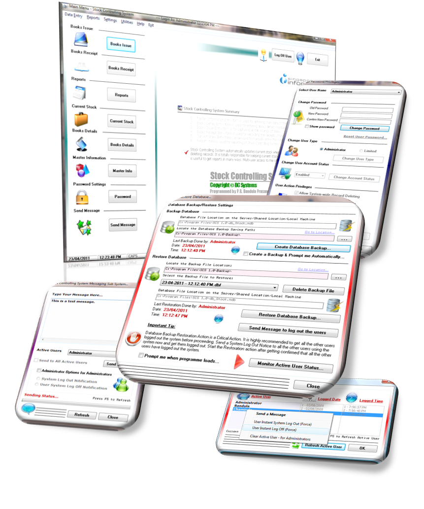



## A Stock Controlling System with a powerful system maintenance sub system with a messaging system\.

### Description

Stock Controlling System is a custom-based complete software which was specially developed for managing stock of books of Singapore Informatics Computer Institute (Pvt) Ltd. It includes great features and gives you an extensive idea of thinking beyond the traditional database programming.

Some of its great features

----

* helps maintaining an accurate stock of books all the time. All the books Issues and Receipts can be easily updated.

* stock Related Reports can be taken in many ways and it consists of 20 diffrent reports including User Log Status reports.

* includes a powerful system maintenance sub system including a messaging system and database Backup/Restore System, which can be used in Multi-user Environment.

* specially developed for Multi-user Environment, which handles the database on the server.

** includes a complete help file, which describes the overall operation of the programme.
 
### More Info
 

             |
---                |---
**Submitted On**   |2011-04-29 16:45:24
**By**             |[P\. G\. B\. Prasanna](https://github.com/Planet-Source-Code/PSCIndex/blob/master/ByAuthor/p-g-b-prasanna.md)
**Level**          |Intermediate
**User Rating**    |5.0 (20 globes from 4 users)
**Compatibility**  |VB 6\.0
**Category**       |[Databases/ Data Access/ DAO/ ADO](https://github.com/Planet-Source-Code/PSCIndex/blob/master/ByCategory/databases-data-access-dao-ado__1-6.md)
**World**          |[Visual Basic](https://github.com/Planet-Source-Code/PSCIndex/blob/master/ByWorld/visual-basic.md)
**Archive File**   |[A\_Stock\_Co2203024302011\.zip](https://github.com/Planet-Source-Code/p-g-b-prasanna-a-stock-controlling-system-with-a-powerful-system-maintenance-sub-system-wi__1-73888/archive/master.zip)

